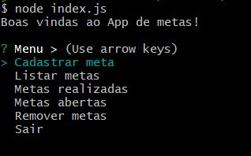

<h1 align="center" style="font-weight: bold;">🗃️ Gerenciador de Metas via Terminal </h1>

  

 

## Sobre
Aplicação desenvolvida durante o evento NLW Pocket Javascript - promovido pela Rocketseat - com a finalidade de aplicar e aprofundar conceitos básicos de Javascript, Node.js, JSON e Github.

## Funcionalidades da aplicação
- Cadastro de metas
- Lista de metas criadas 
- Marcação de metas concluídas
- Lista de metas abertas (que ainda não foram marcadas)
- Lista de metas concluídas (já marcadas)
- Remoção de metas
- Salvamento das alterações em arquivo JSON

## Demonstração de uso:

  

## Tecnologias empregadas
| Tecnologia | Descrição                                                                            |
| ---------- |:------------------------------------------------------------------------------------ |
| JavaScript | Linguagem de programação utilizada para construir a aplicação                        |
| Nodejs     | Ambiente de runtime JavaScript do lado do servidor (back-end)                        |
| Inquirer   | Biblioteca que permite o uso de prompts interativos                                  |
| JSON       | Formato de dados textuais utilizado para a permanência das metas dentro da aplicação |

## Requisitos
> Para instalar a biblioteca Inquirer é necessário possuir o node em uma versão ^16.

## Como executar:
1. Clone o repositório
2. Instale a biblioteca Inquirer executando: `npm install @inquirer` 
3. Inicie a aplicação com: `node index.js`

